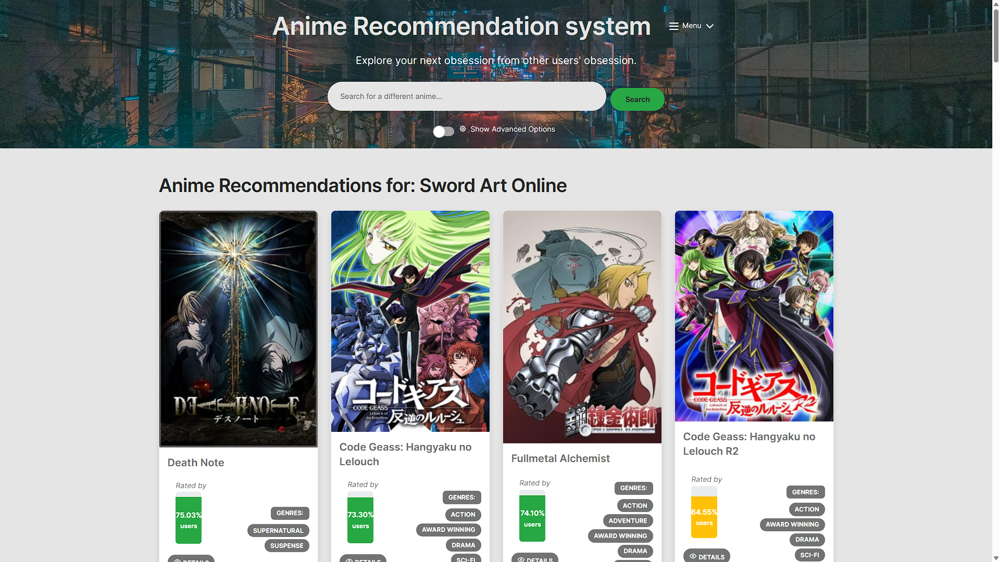

# LIVE CURRENT ALPHA VERSION https://anime-recommendation-system-379818472403.europe-west1.run.app/
# THIS README is under development; the current information here is outdated.
# The information here will be made accurate and precise as soon as possible.
## Table of Contents
1. [Anime Recommendation System](#anime-recommendation-system)
2. [Technology Stack](#technology-stack)
3. [Project Structure](#project-structure)
4. [Database Setup](#database-setup)
5. [Configuration](#configuration)
6. [Recommendation Algorithm](#recommendation-algorithm)
7. [API Endpoints](#api-endpoints)
8. [Configuration Options](#configuration-options)
9. [Testing](#testing)
10. [Deployment](#deployment)

# Anime Recommendation System

 Anime recommendation engine built with Spring Boot that provides personalized suggestions based on collaborative filtering algorithms and user preferences.



## 🚀 Features

### Core Functionality
- **Intelligent Recommendation Engine**: Uses collaborative filtering to suggest anime based on user similarity patterns
- **Advanced Filtering**: Filter by genre, minimum rating, user count, and content preferences
- **User Authentication**: Secure registration and login system with BCrypt password encryption
- **Personalized Experience**: Save search preferences and maintain user profiles
- **Responsive Design**: Modern UI built with Bootstrap and Material Kit

### Technical Highlights
- **Real-time Recommendations**: Fast recommendation generation with performance-optimized queries
- **Configurable Algorithm**: Adjustable weights for occurrence-based vs rating-based recommendations
- **Genre-based Filtering**: Limit recommendations to anime with similar genres
- **Scalable Architecture**: Modular service-oriented design with proper separation of concerns

## 🏗️ Architecture

### Technology Stack
- **Backend**: Spring Boot 3.5.3, Spring Security, Spring Data JPA, hibernate
- **Database**: MySQL 8.0 (containerized with Docker)
- **Frontend**: Thymeleaf, Bootstrap 5.3, Material Kit, Tabler Icons, HTMX
- **Build Tool**: Maven
- **Testing**: JUnit 5
- **Containerization**: Docker & Docker Compose

### Project Structure
```
src/
├── main/
│   ├── java/cz/kocabek/animerecomedationsystem/
│   │   ├── recommendation/          # Core recommendation logic
│   │   │   ├── controller/          # REST and view controllers
│   │   │   ├── service/             # Business logic
│   │   │   ├── repository/          # Data access layer
│   │   │   ├── entity/              # JPA entities
│   │   │   └── dto/                 # Data transfer objects
│   │   ├── security/                # Authentication & authorization
│   │   │   ├── Config/              # Security Beans for filtering endpoints, password endcoding
│   │   │   ├── controller/          # view controllers for login and register
│   │   │   ├── service/             # login, registering inner logic
│   │   │   ├── repository/          # Data access layer
|   |   |   ├──Validation            # password validator
│   │   │   └── dto/                 # registration form dto object         
│   │   └── user/                    # app User management
│   └── resources/
│       ├── templates/               # Thymeleaf templates
│       ├── static/assets/           # CSS, JS, images
│       └── application.properties   # Configuration
└── test/                           # Unit and integration tests
```

## 🛠️ Setup & Installation

### Prerequisites
- Java 24
- Docker & Docker Compose
- Maven 3.6+

### Quick Start

1. **Clone the repository**
   ```bash
   git clone https://github.com/JanKocabek/animeRecomedationSystem.git
   cd animeRecomedationSystem
   ```

2. **Start the database**
   ```bash
   docker-compose up -d
   ```

3. **Run the application**
   ```bash
   ./mvnw spring-boot:run
   ```

4. **Access the application**
   - Open your browser to `http://localhost:8080`
   - Register a new account or continue as guest

### Database Setup
The application uses a containerized MySQL database with anime data from Kaggle datasets:

- **Users**: MyAnimeList user data with viewing statistics
- **Anime**: Comprehensive anime database with genres, ratings, and metadata  
- **UserRatings**: User-anime rating relationships for collaborative filtering

### Configuration
Key configuration options in `application.properties`:
- Database connection: `spring.datasource.url=jdbc:mysql://localhost:3306/mydatabase`
- Security settings: Password encoding, session management
- JPA settings: SQL logging, hibernate configuration

## 📊 Database Schema

### Core Tables
- **anime**: Anime details (id, name, score, genres, episodes, etc.)
- **users**: MyAnimeList user data (id, mean_score, completed, watching, etc.)
- **users_anime_score**: User ratings (user_id, anime_id, rating)
- **app_accounts**: Application user accounts (username, password_hash, role)
- **genres**: Genre categories
- **anime_genres**: Many-to-many relationship between anime and genres

### Relationships
- Users 1:N UserRatings (One user has many anime ratings)
- Anime 1:N UserRatings (One anime has many user ratings)
- Anime M:N Genres (Many-to-many through anime_genres)

## 🧠 Recommendation Algorithm

### Collaborative Filtering Approach
1. **User Selection**: Find users who rated the input anime highly (configurable threshold)
2. **Data Collection**: Gather all anime ratings from these similar users
3. **Statistical Analysis**: Calculate occurrence frequency and average ratings
4. **Weighted Scoring**: Combine occurrence percentage and rating scores with configurable weights
5. **Filtering**: Apply genre and content filters based on user preferences
6. **Ranking**: Sort by composite score and return top recommendations

### Configurable Parameters
- **Minimum Rating**: Filter users by their rating of input anime (default: 8/10)
- **Maximum Users**: Limit analysis to top N users for performance (default: 1500)
- **Genre Filtering**: Restrict to anime with similar genres
- **Algorithm Weights**: Occurrence weight (0.7) + Rating weight (0.7)

### Performance Optimizations
- Paginated database queries to handle large datasets
- Indexed database columns for fast lookups
- Session-based configuration caching
- Streaming data processing for memory efficiency

## 🌐 API Endpoints

### Public Endpoints
- `GET /` - Login page
- `GET /register` - User registration
- `GET /main` - Home page (guest access)
- `POST /submit` - Search form submission
- `GET /result` - Recommendation results page

### Protected Endpoints  


### REST API
- not functioned currently

## 🔧 Configuration Options

### Recommendation Settings
```java
// In ConfigConstant.java
public static final int MIN_INPUT_SCORE = 8;        // Minimum user rating for input anime
public static final int MAX_USERS_PER_PAGE = 1500;  // Max users to analyze
public static final double OCCURRENCE_WEIGHT = 0.7;  // Weight for popularity
public static final double SCORE_WEIGHT = 0.7;      // Weight for rating quality
public static final int FINAL_ANIME_LIST_SIZE = 50;  // Results to return
```

### User Preferences (Runtime Configurable)
- Minimum rating threshold for input anime
- Maximum number of users to analyze
- Genre-based filtering toggle
- Content filtering options - in development


## 🧪 Testing
- under development
Run the test suite:
```bash
./mvnw test
```

### Test Coverage


## 🚀 Deployment

### Development
```bash
docker-compose up -d  # Database only
./mvnw spring-boot:run
```

### Production
```bash
# Build the application
./mvnw clean package

# Run with Docker
docker-compose -f docker-compose.prod.yml up -d
```

## 📈 Performance Metrics

### Typical Performance

### Optimization Features

## 🔒 Security Features

- **Password Security**: BCrypt encryption with salt
- **CSRF Protection**: Spring Security CSRF tokens
- **Input Validation**: Bean Validation with custom constraints
- **SQL Injection Prevention**: JPA/Hibernate parameterized queries
- **Authentication**: Session-based with secure cookie handling

## 🎨 UI/UX Features


## 🤝 Contributing

### Development Workflow
1. Fork the repository
2. Create a feature branch (`git checkout -b feature/amazing-feature`)
3. Commit your changes (`git commit -m 'Add amazing feature'`)
4. Push to the branch (`git push origin feature/amazing-feature`)
5. Open a Pull Request

### Code Style
- Follow Java naming conventions
- Use Spring Boot best practices
- Include unit tests for new features
- Update documentation for API changes

## 📝 License

- This project is developed as an academic portfolio piece.
- All my source code is licensed under [GPLv3.](license.md)
- Except any third-party libraries that are licensed under different terms.
- Kaggle Dataset is licensed under [Database Contents License (DbCL) v1.0](https://opendatacommons.org/licenses/dbcl/1-0/)
- The background image is licensed under [Unsplash license](https://unsplash.com/license)


## 👤 Author

**Jan Kocábek**
- GitHub: [@JanKocabek](https://github.com/JanKocabek)
- Project: [Anime Recommendation System](https://github.com/JanKocabek/animeRecomedationSystem)

## 🙏 Acknowledgments

- **Data Source**: [Kaggle Anime Dataset 2023](https://www.kaggle.com/datasets/dbdmobile/myanimelist-dataset/data?select=users-score-2023.csv)
- **UI Components**: Bootstrap, Material Kit, Tabler Icons
- **Background Image**: [Ian Valerio via Unsplash](https://unsplash.com/photos/aerial-view-photography-of-road-between-highrise-building-CAFq0pv9HjY)
- **Framework**: Spring Boot ecosystem
- **Other**: Thymleaf, HTMX. Maven, Docker, Docker Compose, JUnit 5

---

*This project demonstrates modern backend development practices, algorithm implementation, using industry-standard technologies.*
